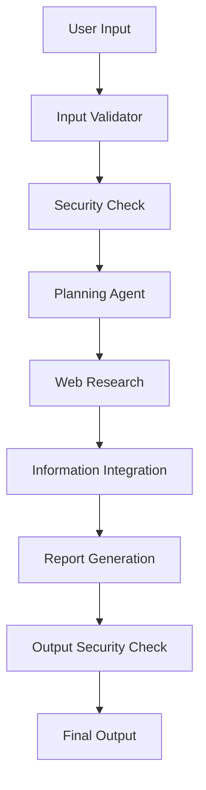

# Secure Research Assistant: CrewAI + Security 🔍 🛡️


This project implements an advanced Large Language Model (LLM) system using CrewAI, featuring robust security guardrails and intelligent agents for comprehensive information processing and analysis. 🔍

## 🌟 Features

- Input validation and security analysis using ZenGuard and LLM Guard
- Multi-agent system with specialized roles:
  - Input Validator and Content Analyzer
  - Planning Agent
  - Web Research Specialist
  - Information Integrator
  - Reporting Agent
- Automated PDF report generation with images
- Comprehensive security checks for both input and output
- Web search and content analysis capabilities

## 🛠️ Installation

1. Clone the repository:

```bash
git clone https://github.com/san3005/secure-crewai-research.git
cd llm-project
```

2. Install required packages:

```bash
pip install crewai crewai[tools]
pip install zenguard llm_guard -U
pip install langchain_openai openai
pip install markdown2 weasyprint
```

## 🔑 Environment Setup

Create environment variables for your API keys:

```bash
export OPENAI_API_KEY='your_openai_api_key'
export SERPER_API_KEY='your_serper_api_key'
export ZENGUARD_API_KEY='your_zenguard_api_key'
```

## 🚀 Usage

1. Import required modules:

```python
from crewai import Agent, Task, Crew, Process
from langchain_openai import ChatOpenAI
from crewai_tools import SerperDevTool, WebsiteSearchTool
```

2. Initialize the system:

```python
llm = ChatOpenAI(model_name="gpt-4", temperature=0.0)
search_tool = SerperDevTool()
```

3. Run the analysis:

```python
user_input = input("Enter the topic you want to know about")
first_crew.kickoff(inputs={'user_input': user_input})
```

## 🤝 Contributing

Contributions are welcome! Please feel free to submit a Pull Request. For major changes, please open an issue first to discuss what you would like to change.


## 🔐 Security Features

- Input validation using ZenGuard
- Code scanning and threat detection
- Prompt injection prevention
- Content moderation
- Output safety checks

## 🛡️ System Architecture



## ⚙️ Dependencies

- CrewAI: Agent-based AI system
- OpenAI: Language model API
- ZenGuard: Security toolkit
- LLM Guard: Input/output protection
- WeasyPrint: PDF generation
- Markdown2: Markdown processing

###### Tags: `AI` `LLM` `Security` `CrewAI` `Python` `Guardrails` `Agentic`

